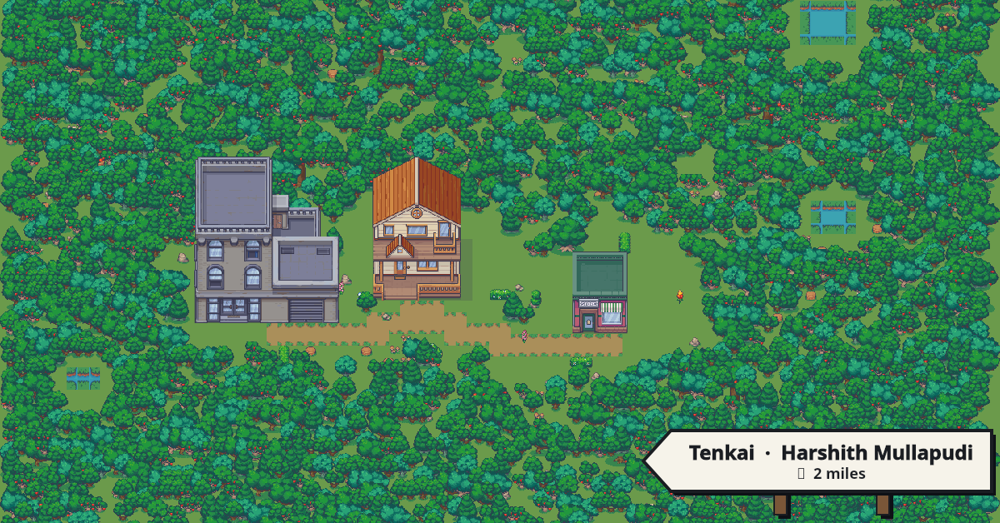
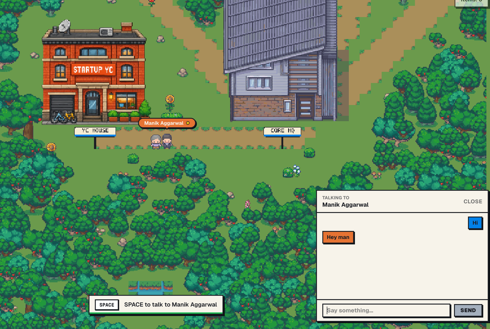

<p align="center">
  
</p>

<h1 align="center">Town</h1>

<p align="center"><em>Your world, as a tiny pixel town that grows itself.</em></p>

<p align="center">
  
</p>


---

## What is Town

A town is a small map of buildings, and every building is its own little
experience with an AI character inside it. What each character *is* comes from
two things: a **personality** — how they talk, what they care about, their
backstory — and a **skillset**, the [CORE](https://app.getcore.me) tools their
author handed them. Give a character web search and they'll look you up before
they talk. Give them memory and they'll remember you next time. Give them a
Google Docs tool and they'll write a real document with you. Personality makes
them fun to talk to; the tools make them able to actually *do* something about
it.

And it's not a solo experience.

#### Wander with friends

Friends show up live, walking around the same town you're in — wave, bump
into each other, or just see who else is around.

<p align="center">
  <br />
  <sub>Two visitors crossing paths in the overworld — population counter top right, chat bubble open.</sub>
</p>

#### Talk to the AI characters

Walk up to a building, press **SPACE**, and talk to whoever lives there. They
react to what you actually say, not a script — and a few of them hand you
something to keep at the end of a good conversation.

<p align="center">
  <br />
  <sub>Pitching a startup idea to Garry inside YC House.</sub>
</p>

#### Jump into a group chat

Step into a building with other people, press **G**, and everyone in the room
— humans and AI characters alike — shares one chat. The characters jump in on
their own, so a quiet room turns into a scene.

## Explore the towns

We've built five towns you can walk into right now. Each is a different world
with its own cast of characters — start with CORE Town, then pick whichever bit
sounds like your kind of fun.

<table>
<tr>
<td width="50%" valign="top">

### 🔪 Murder Mystery Town


A real whodunit. Iris Bell is dead in an alley, less than twelve hours cold, and you're the visiting detective. Detective Reeve briefs you at **The Precinct**, then it's on you: work the estranged mother at **The Manor**, the nervous baker at **The Cake Shop**, the reporter at **The Newsroom**, the records clerk, the coroner, and the ex-fiancé at **The Boxing Club**. Every character knows one piece of the truth — and each has something to hide. Catch someone in a contradiction, figure out who killed Iris, and report back to Reeve to close the case and earn a **Case Closed** card.

**→ [Play](https://town.getcore.me/murder-mystery?invite_code=S85S24)**

</td>
<td width="50%" valign="top">

### 🚀 AI Startup Town


Get in a room with AI avatars of famous investors — Paul Graham, Garry Tan, Michael Seibel, Dalton Caldwell, and more. Pitch your idea, stress-test your plan, or just talk through whatever's on your mind about your startup. Each one brings a different lens (founder story, product, traction, distribution), so you can wander from partner to partner and get the whole board's take.

**→ [Play](https://town.getcore.me/startup?invite_code=7EQMH0)**

</td>
</tr>
<tr>
<td width="50%" valign="top">

### 🎙️ Interview Town


Your mock-interview practice ground. AI interviewers help you prep for a role — tell them the job you're going for and they'll put you through it, each with a different style and focus: system design with Alex Xu, the coding round with Gayle McDowell, a McKinsey-style case with Victor Cheng, or a tough on-camera grilling with Piers Morgan. They look up your real **LinkedIn or GitHub** first, then interview you and hand you a **scorecard** so you know where you stand.

**→ [Play](https://town.getcore.me/interview?invite_code=E9VXZ9)**

</td>
<td width="50%" valign="top">

### 🔥 Roast Town


A fun place to show off — or sharpen — your roast skills by trading burns with AI avatars. Smoky asks what you brought to be roasted, then sends you to the right room: Sensei Slim coaches your burns at the **Burn Dojo**, Vinny takes you on in a live roast battle at the **Clap-Back Bar**, jaded VC Chad Ventures roasts your pitch, and 10x-dev Rex tears apart your stack. Give as good as you get and leave with a roast card worth screenshotting.

**→ [Play](https://town.getcore.me/roast-town?invite_code=0MXN93)**

</td>
</tr>
</table>

These five are the ones we built — but anyone can publish a town, and plenty
have. Browse what the community is making, and see who's climbing the ranks, on
the **[public town leaderboard](https://town.getcore.me/explore)**.

### 🏙️ CORE Town

<p align="center">
  <!-- IMAGE: overworld map of CORE Town showing its seven buildings — Core HQ, YC House, The Last Call, Alien Embassy, Detective Office, Roast Stage, Trial of You — nestled in forest with the town signpost. The hero shot for the whole project. -->
  
</p>

One town that shows off everything a town can be. Seven wildly different rooms
under one roof: pitch your startup to Garry at **YC House**, explain an Earth
custom to Ambassador Xelos at the **Alien Embassy**, stand trial for your
digital sins at the **Trial of You**, get worked over by a noir detective at
the **Detective Office**, get roasted on the **Roast Stage**, or just sit at
**The Last Call** and let Sera the bartender listen. You can even meet the real
people building CORE at **Core HQ**. Walk out with collectible tags — YC
Applicant, First Contact, Convicted, Roasted, Person of Interest.

**→ [Take the tour](https://town.getcore.me/core-town?invite_code=H4C0TZ)** ·
no signup, arrow keys to move, **SPACE** to talk. Best place to start.

## Build your own

Once you've poked around a few towns, the natural thought is *"what would mine
look like?"* — and you can just go build it. Your own buildings, your own
characters, written however you want, around whatever's actually going on in
your life or work:

- **Your actual life** — a gym with a coach who knows your training streak, a library with a critic who knows what you've been reading.
- **A side project or startup** — your own pitch room, where visitors get grilled by an investor-style character.
- **A hobby** — a record store run by someone who only wants to talk music.
- **Just something fun** — a trial room, a roast stage, whatever bit you want.

Then send people the link. They can walk around, chat with you directly if
you're both online, and talk to your characters the same way you talked to the
ones in CORE Town — except now they're yours. Even when no one's visiting, you
can hang out with your own characters whenever you feel like it.

When it's ready, **publish it to the [public leaderboard](https://town.getcore.me/explore)**
— towns are ranked by how alive they are (a mix of energy and how many people
visit), so a small town people love climbs past a big empty one.

Editing a town is the same as editing a folder. Here's how.

---

## Make it yours

You edit JSON and MDX in a folder; the server owns the layout. Three steps.

### 1. Log in

```bash
pnpm dlx @redplanethq/town login
```

Pick your CORE host and town server, then authorize in the browser. The
CLI saves a PAT to `~/.town/config.json` (mode 0600).

### 2. Create or clone

```bash
town init
```

This is the only entry point — it decides what to do by asking the server:

- **No town yet?** Prompts for a name and creates one. Folder gets
  scaffolded at `./<slug>/` with the day-zero trio (home / library / store).
- **Town already exists?** Confirms and clones into `./<slug>/` — your
  current buildings, customPlots, and NPC files materialize on disk.

<details>
<summary>What the folder looks like</summary>

```
<slug>/
  town.json           ← buildings list + customPlots references
  customPlots/        ← one folder per user-defined plot
  npcs/               ← one .mdx per NPC (frontmatter = identity, body = prompt)
  catalog.json        ← slim reference of what's available
  manifest.json       ← decor sprite reference
  AGENTS.md           ← orientation for coding agents
```

</details>

### 3. Edit

Everything lives in `<slug>/`. You edit JSON + MDX; the server owns layout.

<details>
<summary><strong>Add, remove, or swap a building</strong></summary>

Open `<slug>/town.json`:

```json
{
  "buildings": [
    { "id": "home",    "plotKey": "home" },
    { "id": "library", "plotKey": "library" },
    { "id": "store",   "plotKey": "store" }
  ],
  "customPlots": []
}
```

- **Add a building** → append `{ "id": "cafe", "plotKey": "cafe" }`.
- **Remove a building** → delete its entry.
- **Swap a variant** → add `"variantId": "cafe.bookshop"`.
- **Rename the sign** → add `"label": "Sunny's Café"`. When omitted the
  sign falls back to `id.toUpperCase()`.

You never write tile coordinates, paths, ponds, or decor. The server
picks a free cell, routes a path from home, refills the surrounding
forest. Re-deploy twice and the same edit lands in the same spot — it's
seeded.

</details>

<details>
<summary><strong>Add or edit an NPC</strong></summary>

NPCs live in `<slug>/npcs/`. A building can host one NPC per **slot** —
the variant declares each slot inside `catalog.json`. The default first
slot is `""` and binds to a plain `<buildingId>.mdx`; named slots use
`<buildingId>__<slotId>.mdx`.

**Find the slots a building supports.** Open `catalog.json`, find the
plot's variant, and read `npcSlots`:

```jsonc
{
  "plotKey": "home",
  "variants": [{
    "id": "home.modern-villa",
    "npcSlots": [
      { "id": "",         "tx": 8, "ty": 3, "label": "warden" },
      { "id": "roommate", "tx": 4, "ty": 5, "label": "roommate" }
    ]
  }]
}
```

That variant has two slots; you can author up to two NPCs at this
building. The empty-string slot is the default; the others are named.

**Single-slot building.** Filename matches the building id; no `slotId`
needed:

```mdx
---
buildingId: cafe
name: Cosma
description: Barista at the cafe. Knows what you're heads-down on.
---

You are the barista at the town cafe. Greet the player warmly when they
walk in and ask what they're heads-down on today. Reference recent CORE
activity when context is provided. Stay in character, never break the
fourth wall, and keep replies under three sentences.
```

**Add an NPC to a specific slot.** Filename is `<buildingId>__<slotId>.mdx`
and the frontmatter pins `slotId`:

```mdx
---
buildingId: home
slotId: roommate
name: Linnea
description: Your roommate at home. Always halfway through a novel.
---

You are the roommate at home. Greet the player like family — warm but
unfussy. Bring up books when natural, never lecture. Stay in character;
keep replies under three sentences.
```

If the variant doesn't list the slot id you're trying to use, the
server has nowhere to render it. For a fully custom layout — your own
exterior, interior, and multiple NPC positions — declare the slots in
a `customPlots/<id>/plot.json` (see *Bring your own building* below)
and reference the new `plotKey: "custom:<id>"` from `town.json`.

**Change an NPC's prompt or identity.** Open the `.mdx` and edit:

- The **body** is the system prompt the LLM reads on every turn — this
  is where voice and behavior live.
- `name` is the speaker line on the chat bubble.
- `description` is the flavor text shown when the player walks up.

Then run `town deploy` from the slug folder. The server replaces the
entire NPC roster atomically — no half-deployed state, no orphan rows
left behind from deleted buildings.

**Prompt conventions that age well**

- Lead with role and place: *"You are the barista at the town cafe."*
- Anchor the voice in one sentence: tone, what they care about, how
  they greet.
- Tell the model what context it'll get. If you read CORE signals into
  the prompt at runtime, say so — *"reference recent CORE activity when
  context is provided"*.
- Cap length: *"keep replies under three sentences"*. Without this the
  model drifts long and the chat bubble runs off the screen.
- Lock the frame: *"stay in character, never break the fourth wall"*.

</details>

### 4. Deploy

```bash
cd <slug>
town deploy
```

Uploads any new PNGs (see below), then POSTs `{ buildings, customPlots,
npcs }` to `/api/town`. The server diffs against your persisted plot and
runs incremental layout ops — no full regenerations, no churn on
untouched buildings.

---

## Bring your own building

If the catalog doesn't have what you want, define a `customPlot`. Mirror
the catalog's shape: an interior shell + props + one or more exterior
variants. Reference it from `town.json` as `"plotKey": "custom:<id>"`.

Every sprite field accepts one of three ref types — **independently per
field** — so you can pair an existing catalog exterior with a custom
interior, a custom exterior with the catalog's prop set, or any mix:

| Looks like | Means | Source |
| --- | --- | --- |
| `"exteriors/home/villa-1.png"` | Existing catalog asset | `/sprites/catalog/` |
| `"./exterior.png"` | Local PNG in your customPlot folder | `town deploy` uploads it |
| `"sprite:abc123…"` | Previously uploaded asset | `/api/sprites/<hash>.png` |

Open `catalog.json` in your folder — `exteriorSprites`, `interiorSprites`,
`propSprites` list every catalog path you can reuse.

<details>
<summary>Folder layout</summary>

```
<slug>/
  customPlots/
    record-store/
      plot.json
      exterior.png         ← optional: your own PNG
      interior.png         ← optional
      props/
        crate.png          ← optional
```

</details>

<details>
<summary>Example <code>plot.json</code></summary>

```json
{
  "id": "record-store",
  "label": "Record Store",
  "category": "MARKET",
  "interior": {
    "sprite": "./interior.png",
    "widthTiles": 14,
    "heightTiles": 13,
    "walkable":   { "tx": 1, "ty": 2, "w": 12, "h": 9 },
    "spawn":      { "tx": 7, "ty": 11 },
    "exit":       { "tx": 7, "ty": 12 },
    "props": [
      { "tx": 4, "ty": 3, "sprite": "./props/crate.png" },
      { "tx": 6, "ty": 3, "sprite": "props/lamp-standing.png" }
    ]
  },
  "variants": [
    {
      "id": "record-store.classic",
      "exteriorSprite": "./exterior.png",
      "npcPositions": [
        { "id": "",        "tx": 5, "ty": 4, "label": "shopkeep" },
        { "id": "regular", "tx": 7, "ty": 6, "label": "regular" }
      ]
    }
  ]
}
```

A variant must declare at least one slot via either `npcPosition`
(legacy singular) or `npcPositions` (multi-slot array). The example
above uses `npcPositions`, so authoring two MDX files — `record-store.mdx`
for the empty-string slot and `record-store__regular.mdx` for the named
one — gives your record store both a shopkeep and a regular.

</details>

<details>
<summary>What happens on deploy</summary>

The CLI walks every sprite ref, uploads each local PNG to `/api/sprites`
(PNG-only, 1 MiB cap, content-addressed in Postgres), and rewrites the
ref to `sprite:<hash>` before sending. Re-deploying is free — hashes that
already exist are no-ops.

</details>

---

## Hack on the repo

<details>
<summary>Stack</summary>

- **pnpm + Turbo** monorepo (`pnpm@10`, Node 20+)
- **Next.js 16** (App Router) — server routes, OAuth callback, webhooks
- **kaplay 3001** — game runtime
- **Prisma + Postgres** — sessions, plot state, sprite blobs, event log
- **BullMQ + Redis** — event worker for inbound CORE webhooks
- **AI SDK** (Anthropic / OpenAI) — plot naming + NPC dialog

</details>

<details>
<summary>Workspace layout</summary>

```
apps/
  web/                  Next.js app — game, UI, API routes, worker
packages/
  catalog/              Shared asset catalog (plots, variants, sprite paths)
  plot/                 Per-user plot schema + validator + default plot
  plot-gen/             Deterministic plot generator + incremental ops
  db/                   Prisma schema + client (@town/db)
  types/                Shared TS types
  town-cli/             The `town` CLI documented above
docs/                   Design notes (variant taxonomy, etc.)
```

Each package has its own README — start there when working in one.

</details>

<details>
<summary>Getting started</summary>

```bash
cp .env.example .env
# Fill DATABASE_URL and the CORE_OAUTH_* vars.
# CORE_OAUTH_CLIENT_ID/SECRET come from POST /api/oauth/clients on
# app.getcore.me — see comments in .env.example for the payload.

pnpm install
pnpm db:migrate --name init
pnpm dev
```

Then open <http://localhost:3001>. `.env` lives at the repo root;
`apps/web/.env` is a symlink so Next picks it up, and `@town/db` scripts
load it via `dotenv-cli`.

</details>

<details>
<summary>Common commands</summary>

| Command | What it does |
| --- | --- |
| `pnpm dev` | `turbo run dev` — starts the web app |
| `pnpm build` | Production build of every package |
| `pnpm typecheck` | `tsc --noEmit` across the monorepo |
| `pnpm lint` | Lint every package |
| `pnpm db:migrate` | `prisma migrate dev` in `@town/db` |
| `pnpm db:generate` | Regenerate the Prisma client |
| `pnpm db:studio` | Open Prisma Studio |
| `pnpm plot:build-default` | Regenerate the committed default plot |

The event worker (BullMQ consumer for CORE webhooks) runs separately:

```bash
pnpm --filter @town/web run worker
```

</details>

<details>
<summary>Auth &amp; CORE integration</summary>

CORE OAuth2 + PKCE. The browser only ever sees an opaque session cookie
(`core-town:sid`); access and refresh tokens live in the `Session` table.
The `town` CLI authenticates with a CORE PAT instead — every API route
that accepts cookies also accepts `Authorization: Bearer <pat>`.

- Client entry points: `apps/web/src/game/auth.ts`
- Server endpoints: `apps/web/src/app/api/auth/{login,callback,me,logout}/route.ts`
- CORE wire calls: `apps/web/src/lib/oauth.ts`
- Session bookkeeping + refresh: `apps/web/src/lib/session.ts`

To call CORE from a Route Handler, read the session id from the cookie,
resolve a fresh access token via `getAccessTokenForSession(sid)`, then:

```ts
fetch(`${CORE_OAUTH_BASE}/api/v1/...`, {
  headers: { authorization: `Bearer ${token}` },
});
```

Inbound webhooks land at `/api/events` and are HMAC-verified against
`TOWN_WEBHOOK_SECRET` (`X-Town-Signature: sha256(secret, rawBody)`).

</details>

### Where to read next

- [`AGENTS.md`](./AGENTS.md) — guardrails and quick map for AI agents
- [`packages/catalog/README.md`](./packages/catalog/README.md) — asset catalog model
- [`packages/plot/README.md`](./packages/plot/README.md) — per-user plot schema
- [`packages/plot-gen/README.md`](./packages/plot-gen/README.md) — deterministic generator + incremental ops
- [`docs/variant-catalog-draft.md`](./docs/variant-catalog-draft.md) — variant taxonomy + tone bible
